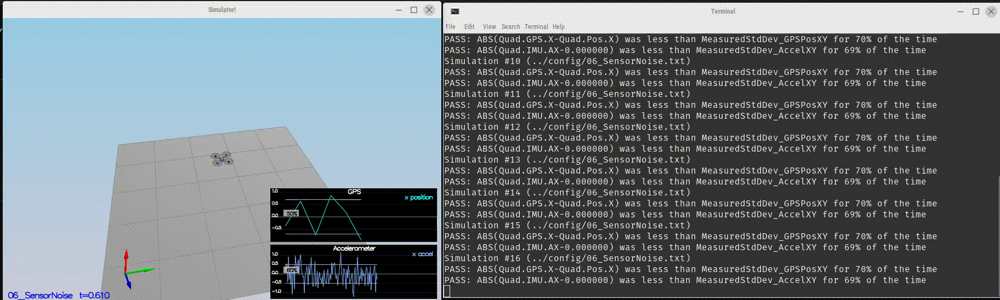
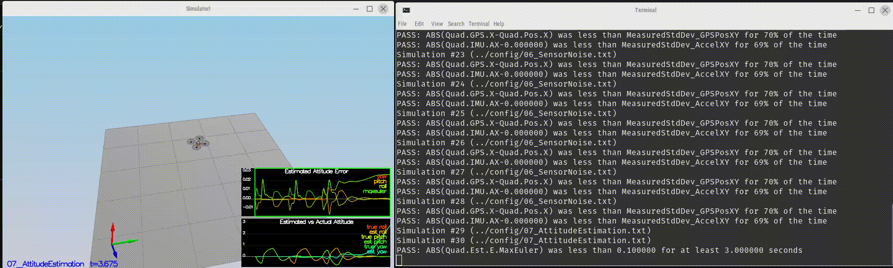

# Estimation Project #


## Setup ##

This project will continue to use the C++ development environment you set up in the Controls C++ project.

 1. Clone the repository
 ```
 git clone https://github.com/udacity/FCND-Estimation-CPP.git
 ```

 2. Import the code into your IDE like done in the [Controls C++ project](https://github.com/udacity/FCND-Controls-CPP#development-environment-setup)

 3. You should now be able to compile and run the estimation simulator just as you did in the controls project


### Project Structure ###

For this project, you will be interacting with a few more files than before.

 - The EKF is already partially implemented for you in `QuadEstimatorEKF.cpp`

 - Parameters for tuning the EKF are in the parameter file `QuadEstimatorEKF.txt`

 - When you turn on various sensors (the scenarios configure them, e.g. `Quad.Sensors += SimIMU, SimMag, SimGPS`), additional sensor plots will become available to see what the simulated sensors measure.

 - The EKF implementation exposes both the estimated state and a number of additional variables. In particular:

   - `Quad.Est.E.X` is the error in estimated X position from true value.  More generally, the variables in `<vehicle>.Est.E.*` are relative errors, though some are combined errors (e.g. MaxEuler).

   - `Quad.Est.S.X` is the estimated standard deviation of the X state (that is, the square root of the appropriate diagonal variable in the covariance matrix). More generally, the variables in `<vehicle>.Est.S.*` are standard deviations calculated from the estimator state covariance matrix.

   - `Quad.Est.D` contains miscellaneous additional debug variables useful in diagnosing the filter. You may or might not find these useful but they were helpful to us in verifying the filter and may give you some ideas if you hit a block.


## The Tasks ##

Once again, you will be building up your estimator in pieces.  At each step, there will be a set of success criteria that will be displayed both in the plots and in the terminal output to help you along the way.

Project outline:

 - [Step 1: Sensor Noise](#step-1-sensor-noise)
 - [Step 2: Attitude Estimation](#step-2-attitude-estimation)
 - [Step 3: Prediction Step](#step-3-prediction-step)
 - [Step 4: Magnetometer Update](#step-4-magnetometer-update)
 - [Step 5: Closed Loop + GPS Update](#step-5-closed-loop--gps-update)
 - [Step 6: Adding Your Controller](#step-6-adding-your-controller)


### Step 1: Sensor Noise ###

For the controls project, the simulator was working with a perfect set of sensors, meaning none of the sensors had any noise.  The first step to adding additional realism to the problem, and developing an estimator, is adding noise to the quad's sensors.  For the first step, you will collect some simulated noisy sensor data and estimate the standard deviation of the quad's sensor.

* Running the simulator. If your values are correct, the dashed lines in the simulation will eventually turn green, indicating you’re capturing approx 68% of the respective measurements (which is what we expect within +/- 1 sigma bound for a Gaussian noise model)

- **Scenario_1** : <u>Pass</u> :

  PASS: ABS(Quad.GPS.X-Quad.Pos.X) was less than MeasuredStdDev_GPSPosXY for 70% of the time
  PASS: ABS(Quad.IMU.AX-0.000000) was less than MeasuredStdDev_AccelXY for 69% of the time

  

  


### Step 2: Attitude Estimation ###

including information from our IMU.  In this step,  will be improving the complementary filter-type attitude filter with a better rate gyro attitude integration scheme.

* **Scenario_2** : <u>Pass</u>:

  -  implement a non-linear one to get better results. First, we need to find the roll, pitch and yaw derivates using the following equation from the control lectures.

  - Once we have the derivate, we can multiply them by `dt` to approximate the integral. The following is a more detail graph after the non-linear integration.

    

  **PASS**: ABS(Quad.Est.E.MaxEuler) was less than 0.100000 for at least 3.000000 seconds




### Step 3: Prediction Step ###

In this step i did implement the prediction step of the filter. starting by predict the state based on the acceleration measurement. Without modifying the code to estimate the drift, after that updating the covariance matrix to finish the EKF state.

* **Scenario_3** : <u>Pass</u>: 

  PASS: ABS(Quad.Est.E.MaxEuler) was less than 0.100000 for at least 3.000000 seconds


### Step 4: Magnetometer Update ###

Up until now we've only used the accelerometer and gyro for our state estimation.  In this step, you will be adding the information from the magnetometer to improve your filter's performance in estimating the vehicle's heading.

we need to use the equations from section `7.3.2 Magnetometer` from the [Estimation for Quadrotors](https://www.overleaf.com/read/vymfngphcccj#/54894644/) paper.

You can see there the yaw error decrease, and the sigma remained stable. Here is a scenario video:


* **Scenario_4** : <u>Pass</u>: 

  PASS: ABS(Quad.Est.E.Yaw-0.000000) was less than Quad.Est.S.Yaw for 63% of the time

  PASS: ABS(Quad.Est.E.Yaw-0.000000) was less than Quad.Est.S.Yaw for 79% of the time


### Step 5: Closed Loop + GPS Update ###

The last step before to finish the EKF implementation: GPS Update. After eliminating the ideal estimator of the code without any code modification.

To implement this update, we need to use the equations from section `7.3.1 GPS` from the [Estimation for Quadrotors](https://www.overleaf.com/read/vymfngphcccj#/54894644/) paper.


**Scenario_5** : <u>Pass</u>: 

PASS: ABS(Quad.Est.E.Pos) was less than 1.000000 for at least 20.000000 seconds

### Step 6: Adding Your Controller ###

Up to this point, we have been working with a controller that has been relaxed to work with an estimated state instead of a real state.  So now, you will see how well your controller performs and de-tune your controller accordingly.

in this step putting the control and parameters from the last project and see how it behaves in a noisy scenario.


* **Scenario_6** : <u>Pass</u>: 

  ASS: ABS(Quad.Est.E.Pos) was less than 1.000000 for at least 20.000000 seconds

  

**Hint: you may find it easiest to do your de-tuning as a 2 step process by reverting to ideal sensors and de-tuning under those conditions first.**

# [Project Rubric](https://review.udacity.com/#!/rubrics/1807/view)

## Writeup

### Provide a Writeup / README that includes all the rubric points and how you addressed each one. You can submit your write-up as markdown or pdf.

This is the write-up.

## Implement Estimator

### Determine the standard deviation of the measurement noise of both GPS X data and Accelerometer X data.

 This scenario test output:

PASS: ABS(Quad.GPS.X-Quad.Pos.X) was less than MeasuredStdDev_GPSPosXY for 70% of the time
PASS: ABS(Quad.IMU.AX-0.000000) was less than MeasuredStdDev_AccelXY for 69% of the time

### Implement a better rate gyro attitude integration scheme in the `UpdateFromIMU()` function.

The implementation of this integration is at [QuadEstimatorEKF.cpp](QuadEstimatorEKF.cpp#L99-L121) from line 99 to line 121. This scenario test output:

ABS(Quad.Est.E.MaxEuler) was less than 0.100000 for at least 3.000000 seconds

### Implement all of the elements of the prediction step for the estimator.

The different elements of the predict step are implemented at:

- `PredictState` method: [QuadEstimatorEKF.cpp](QuadEstimatorEKF.cpp#L180-L192) line 180 to line 192.
- `GetRbgPrime` method: [QuadEstimatorEKF.cpp](QuadEstimatorEKF.cpp#L216-L234) line 216 to line 234.
- `Predict` method: [QuadEstimatorEKF.cpp](QuadEstimatorEKF.cpp#L216-L234) line 277 to line 288.

### Implement the magnetometer update.

The magnetometer update is implemented at [QuadEstimatorEKF.cpp](QuadEstimatorEKF.cpp#L341-L353) line 341 to line 353. This scenario test output:

PASS: ABS(Quad.Est.E.Yaw-0.000000) was less than Quad.Est.S.Yaw for 63% of the time

PASS: ABS(Quad.Est.E.Yaw-0.000000) was less than Quad.Est.S.Yaw for 79% of the time


### Implement the GPS update.

The GPS update was implemented at [QuadEstimatorEKF.cpp](QuadEstimatorEKF.cpp#L310-L322) line 310 to line 322. This scenario test output:

ASS: ABS(Quad.Est.E.Pos) was less than 1.000000 for at least 20.000000 seconds

## Flight Evaluation

### Meet the performance criteria for each step.

The code meets all the performance criteria. There are samples of each scenario test output on the above rubric points.

### De-tune your controller to successfully fly the final desired box trajectory with your estimator and realistic sensors.

After adding last project control parameters and controller, the drone successfully executes the trajectory.Submission

For this project, you will need to submit:

 - a completed estimator that meets the performance criteria for each of the steps by submitting:
   - `QuadEstimatorEKF.cpp`
   - `config/QuadEstimatorEKF.txt`
 - a re-tuned controller that, in conjunction with your tuned estimator, is capable of meeting the criteria laid out in Step 6 by submitting:
   - `QuadController.cpp`
   - `config/QuadControlParams.txt`
 - a write up addressing all the points of the rubric


Yassine.H April_2020

